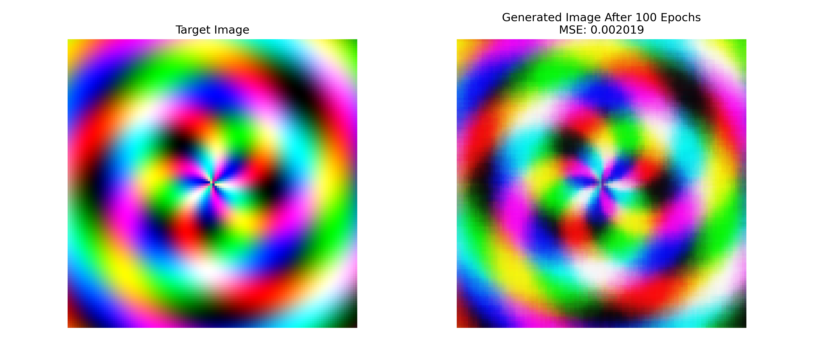
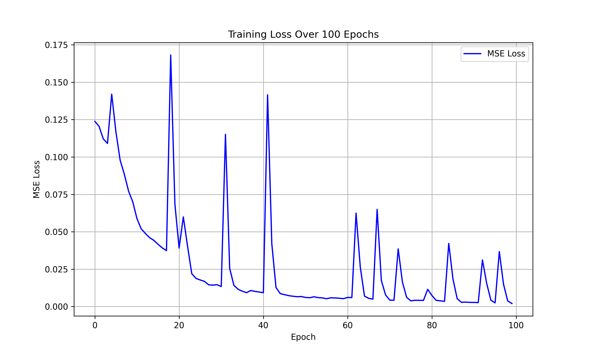

# **Neural Image Synthesis with Positional Encoding**  

A neural network that learns to generate an abstract image using coordinate-based MLPs with positional encoding. The model is trained to reconstruct a target pattern while using reinforcement learning to dynamically adjust the learning rate.  

## **Features**  
✅ **Abstract Image Synthesis** – Generates visually appealing patterns such as swirls, waves, and fractals.  
✅ **Coordinate-Based MLP** – Uses a neural network to map (x, y) coordinates to RGB values.  
✅ **Positional Encoding** – Enhances learning by applying high-frequency encodings.  
✅ **Reinforcement Learning (RL) for Learning Rate Adaptation** – Optimizes training dynamics.  
✅ **GIF Progression** – Creates an animated GIF to visualize training progress over epochs.  


just clone repository and run all cells , and this will:  
- Train the model for **100 epochs**  
- Save intermediate images to `epoch_images/`  
- Generate a final output comparison  
- Create a GIF of training progress  

## **Example Outputs**  
### 🎯 **Target Image vs. Generated Image** (After Training)  
  

### 📉 **Loss Curve Over 100 Epochs**  
  

### 🎞 **Training Progress GIF**  


## **Customization**  
Modify `image_style` in `train.py` to generate different abstract patterns:  
```python
image_style = 'swirl'  # Options: 'swirl', 'waves', 'fractal'
```

## **License**  
This project is licensed under the MIT License.  
